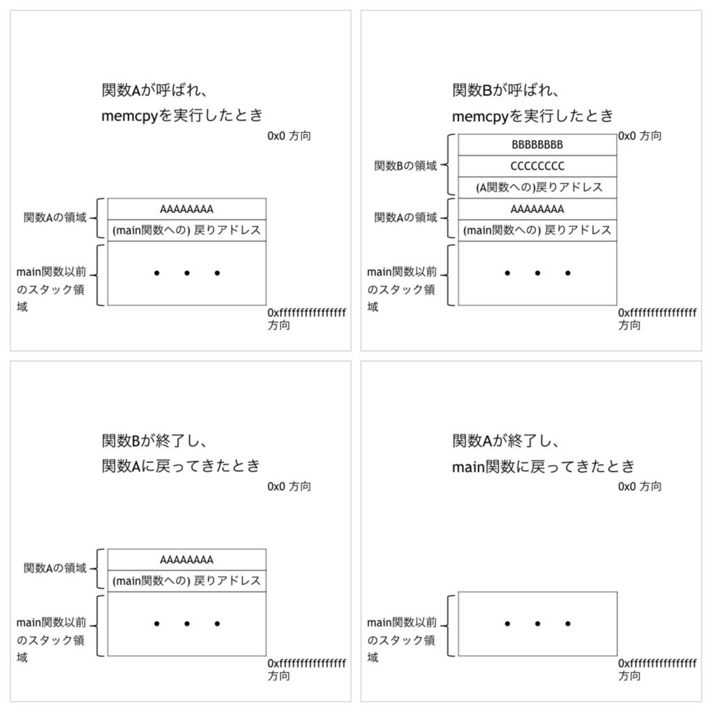

# Buffer Overflow (バッファオーバーフロー)

## Buffer(バッファ)とは

通常コンピュータプログラムは何らかの情報を格納するための領域をメモリ上に確保する。
その確保する情報とは数値や文字列であったり、文字情報を確保する際には、文字数に応じて連続したメモリ領域を確保する必要がある。

この同じ形式のデータ(ここでは文字)を複数個格納するために**メモリ上に確保する領域のことをバッファ領域**と読んでいる。

バッファの確保方法には**スタック**と**ヒープ**の2種類がある。
`スタックは、主に関数内で一時的に利用するデータを格納`するために利用される。
関数を呼び出す際は、関数呼び出し命令の次の命令が格納されているアドレス、つまり`子関数からの戻り先アドレス（以下、リターンアドレス）もスタックに格納`される。

`ヒープはプログラムによってメモリが必要になった際に、動的に確保`されたり、`プログラムの開始から終了まで参照される情報`を格納しておく領域。

## オーバーフローが起こる原因

なぜメモリ上に確保したバッファ領域はオーバーフローを起こすのか。
メモリは無限に存在するわけではないため、メモリ上に確保されるバッファ領域の大きさにも上限がある。

`バッファ領域の上限はプログラムが規定しているが、プログラムを実行するCPUはバッファ領域の上限を知らない`。CPUはプログラムに従って命令を実行するだけです。

情報をバッファ領域に格納する際、`格納する情報の大きさがバッファ領域の上限より小さい場合`は問題はないが、バッファ領域の上限を超えてしまう場合、`CPUはバッファ領域を超えて情報を格納`してしまい、バッファがオーバーフローしてしまう。

バッファオーバーフローが起こってしまうと、`メモリ上の不正な場所に情報を格納する`ことになってしまい、**プログラムが誤動作**することになってしまう。


### セキュリティーホールになるわけ

バッファオーバーフローがセキュリティホールになるワケをスタック上に確保されるバッファを例にする。

スタックには、CPUがそれまで実行していた関数の内部で使用しているバッファやリターンアドレスなどが保存される。
スタック上に存在するバッファでオーバーフローが発生すると、**リターンアドレスが格納されている領域も書き換えられてしまう**ことがある。`バッファオーバーフローによってリターンアドレスが書き換えられてしまう`と、親関数に戻る際に`正常なアドレスに戻れなくなる`。

この`バッファオーバーフローを利用して、リターンアドレスに「悪意のあるコードを格納しているメモリアドレス」をセットすることができる`としたらどうなるか。
親関数に戻る際に**本来の制御を横取りして、悪意のあるコードを実行**することができてしまう。

## バッファオーバーフローの流れ

下記の図の上側のようにスタック上のバッファ領域より大きい入力データのコピーが行われたとする。


上図のコピー後のスタックの状態のように、**バッファ領域より大きい入力データをサイズのチェックを行わずにコピー**を行ってしまうと、`バッファオーバーフローによりリターンアドレスが書き換え`られてしまう。

**プログラムが本来実行すべきリターンアドレスが書き換えられてしまう**ため、`プログラムが誤動作`してしまう。
命令アドレスが悪意のあるコードの存在するメモリアドレスで書き換えられた場合、CPUは悪意のあるコードを実行することになってしまう。

悪意のあるコードはどこにあるのか。答えは**オーバーフローさせるバッファに存在**する。
先ほどの図の下側のように入力するデータを作成することでバッファオーバーフローにより、悪意のあるコードを実行させることができる。
*悪意のあるコードのアドレスはスタック上であればある程度予測することが可能*であり、他にも**悪意のあるコードを実行させるためのテクニックがいくつか存在**する。

## 対策

どのようにすればバッファオーバーフローが発生しないプログラムを作成することができるのか。
C言語でプログラムを作成する際に注意することとしては以下のような点が挙げられる。

- バッファにデータを保存する際にデータサイズがバッファサイズを超えていないことを常に確認
- 標準関数の中で`strcpy`や`strcat`といったバッファのサイズをチェックしないでコピーする関数は使用しない

それでもバッファオーバーフローによるセキュリティホールが数多く見つかる。
プログラマが**間違った形式のデータが入力されることはないだろうという思い込み**や、プログラムの**実行速度を早くするため余計な処理を省く過程でチェック処理を省略**してしまうというようなことが考えられる。

個人で利用するために作成したプログラムならそれでも構わないが、広く公開し誰が使用するかは分からないプログラムの場合、`プログラマの想定していない使い方をされる可能性`が十分ある。
そのため、想定していないデータが入力されることは確実に存在する。

バッファオーバーフローを発生させないプログラムを作成するためには、`プログラマが入力データの形式を信用しない`ことが重要。
`プログラムをテストする際に、セキュリティホールとして利用できるかどうかという観点でテストを行うことも重要`になる。

# スタックオーバーフロー

**スタックとは**

プログラムが実行されるときにはメモリが使用される。
このメモリは、64bitであれば16進数で0x0 ~ 0xffffffffffffffff まであり、プログラムのコードやプログラム中で使用した変数の値などが保存される。

スタックはメモリ上の領域であり、主にプログラムが関数を呼び出した時に関数内で宣言された値を格納するために使用される。

また、関数内で宣言してもmallocなどの動的確保された値はスタック領域には保存されず、ヒープ領域に保存される。

これは、関数を呼び出すごとに積み重ねられ、*関数が終了すると新しいものからポップ*される。

実際のメモリ内では、`スタックは高いアドレス (0xffffffffffffffff) の方から低いアドレスの方 (0x0) に伸びて`おり、`ヒープは低いアドレスから高いアドレスに伸びて`いる。

**IP(インストラクションポインタ)**

スタックの詳しい説明には、IPという用語を理解する必要がある。

IP(インストラクションポインタ、またはプログラムカウンタ)は、次に実行する命令を格納するレジスタである。
レジスタが何かわからない人のために簡単に説明すると、レジスタとは*CPUそのものに内蔵されている記憶装置の一つ*である。(詳しい説明はここでは省く)

IPの動作をC言語を用いて説明する。

```c:ip.c
#include <stdio.h>

int test () {
    int n = 0;

    return 0;
}

int main () {
    int i = 0;

    test();

    return 0;
}
```

上記のコードで、プログラムが10行目を実行し終わった所だとする。(int i = 0)
そうすると、IPには次に実行する12行目の部分( test() )のアドレス格納される。

次に12行目が実行されるが、これは関数呼び出しである。
関数呼び出しでは、次に実行すべき命令のアドレス（ここでは、14行目の return 0）をスタックに保存してからその関数を実行する。

これは、関数が終了して戻ってきた際に次にどのアドレスにある命令を実行すればよいかを知るためである。

関数が呼び出されて4行目(test関数内のint n = 0)が実行され、次に6行目(test関数内のreturn 0)が実行される。
ここで、test関数は終了するのだが、関数呼び出しの時にスタックに保存したアドレス(14行目部分のアドレス)をIPに設定することで、main関数に戻り14行目を実行する。

IPはこのように、プログラムを実行するにおいて重要な役割を担っている。
オーバーフローなどの脆弱性がある場合、`攻撃者はこのIPの値を上書きすることでメモリ上の任意の場所にある命令を実行`することができる。

**スタックの動作**

スタックは、LIFO(後入れ先出し)方式の構造で、PUSHで値を格納し、POPで値を取り出す。
実際にプログラムでどう使用されるか簡単に説明する。
例えば、以下のようなプログラムを実行するとしよう。

```c:lifo.c
#include <stdio.h>

void B() {
  char buf[16];
  memcpy(buf, "BBBBBBBBCCCCCCCC", 16);
}

void A() {
  char buf[8];
  memcpy(buf, "AAAAAAAA", 8);

  B();
}

int main() {

  A();

  return 0;
}
```

上記は、main関数で関数Aを呼び出し、関数Aの中で関数Bを呼び出す単純なコードである。
ここで各呼び出しと関数終了時のスタックの状態を見るとおおよそ次のようになる。



また、変数に格納される値は、高いアドレス(画像で言うと下)方向(0xffffffffffffffff)に格納されていくので、`もし関数Bで16を越える文字列が配列bufにコピー`すると*戻りアドレスが上書き*される。
（実際は、配列と戻りアドレスの間は少し空いているので、数バイト溢れただけでは戻りアドレスは上書きされない）

**スタックオーバーフローを起こす**

実際にスタックオーバーフローを起こすコードを書いてみる。

```c:stack_overflow.c
// vul.c
#include <stdio.h>
#include <string.h>

int main() {
  char buf[8];

  memcpy(buf, "AAAAAAAAAAAAAAAAAAAAAAAAA", 25);

  return 0;
}
```

上記のコードは8文字文の配列であるbufに25文字を入れたことにより、バッファが溢れ、その影響でプログラムが強制終了する。

```Bash
$ uname -a
Linux cmp 5.11.0-40-generic #44~20.04.2-Ubuntu SMP Tue Oct 26 18:07:44 UTC 2021 x86_64 x86_64 x86_64 GNU/Linux

$ gcc stack_overflow.c -o stack_overflow -fno-stack-protector
$ ./stack_overflow
Segmentation fault (core dumped)
```

gccのコンパイラのオプションに`-fno-stack-protector`を付けることで、スタック・オーバーフロー・セキュリティー・チェックが行われないようにする。

実際にコンパイルして実行してみると、想定通りにオーバーフローを起こして強制終了したことがわかる。

これは、関数に戻るためのアドレスが上書きされたことにより、よくわからないアドレスにある命令を実行しようとしてエラーが発生し、プログラムが強制終了したからである。

また、上記で出力された segmentation fault とは、アクセスが許可されていないアドレスにアクセスすると起こるエラーである。


ASLR

ret2esp

