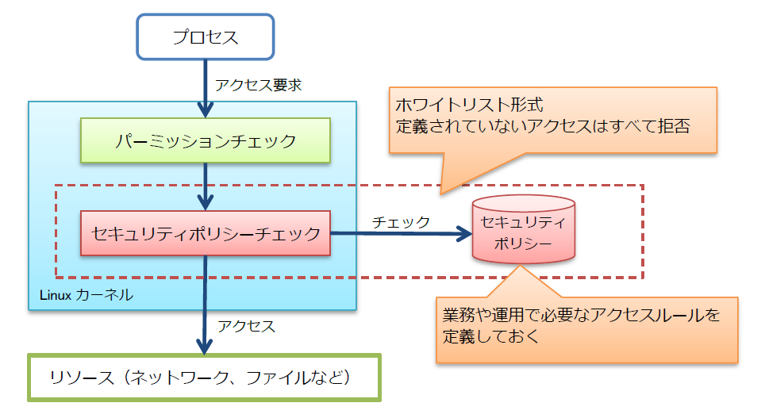
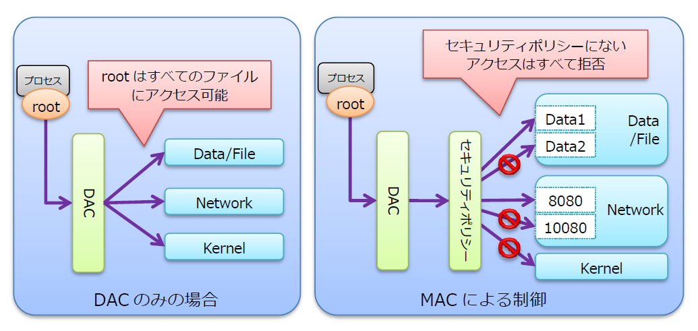

# 強制アクセス制御

Linuxには強制アクセス制御(MAC:Mandatory Access Control)と呼ばれるセキュリティを強化する機能が標準で搭載されている。

この強制アクセス制御機能を活用することで、サーバに不正侵入を許した場合でも被害を限定化するなどリスクを低減することができる。

強制アクセス制御には、**SELinux(Security-Enhanced Linux)**、**AppArmor(Application Armor)**、TOMOYO Linuxなどいくつかの種類がある。

## SELinux

SELinuxは、アメリカ国家安全保障局(NSA)が中心となって開発した、Linuxのカーネルに強制アクセス制御を付加するモジュールです。

強制アクセス制御は、**「誰が何にどのようにアクセスできるか」**というセキュリティポリシーに従ったアクセス制御を強制する。
このアクセス制御は*ホワイトリスト形式*となっており、あらかじめ定義したアクセスルール以外のアクセスについてはすべて拒否する。



例えば、あるプログラムが脆弱性を突かれ、プロセスを乗っ取られてroot権限に昇格された場合、従来からある任意アクセス制御(DAC：Discretionary Access Control)ではroot特権によりすべてのファイルにアクセスが可能で、システム全体に影響が及んでしまう。

それに対してSELinuxが有効なシステムでは、強制アクセス制御(MAC)によりそのプロセスがアクセスできる範囲を限定する。
結果、破壊活動を行おうとしてもアクセス拒否が発生し、動きを封じ込めることができる。



この仕組みでSELinuxは定期的なパッチの適用が難しいシステムや、一般に知られない間に脆弱性が発生する「ゼロディ攻撃」などに有効であると言われている。

しかし、`SELinux`はサーバに侵入された後の被害を極小化させるものであり、侵入を防ぐものではありませんので、別でファイアウォールや侵入検知システムなど侵入させないための仕組みが必要。


### DAC(任意アクセス制御)とMAC(強制アクセス制御)の違い

*DAC(任意アクセス制御)*

DACは、ログインユーザ情報とリソースの所有者情報を基にアクセス制御を行うもの。
また、ファイルの所有者がパーミッションの設定を自由に変更できるほか、rootユーザは特権によりすべてのファイルにアクセスすることが可能。

*MAC(強制アクセス制御)*

MACはセキュリティポリシーに従ったアクセス制限をrootユーザを含む全てのユーザやプロセスに強制させる仕組み。
セキュリティポリシーに登録されているアクセスルールはセキュリティ管理者のみが変更でき、ファイルの所有者でもアクセスルールを変更できないようになっている。

この2つのアクセス制御の違いを簡単にまとめると、以下のようになる。

```
# 従来のアクセス制御 DAC(任意アクセス制御)

- アクセス制御方式 : 伝統的なUNIXパーミッションによるアクセス制御
- 制御内容 : ユーザIDやグループID とリソースの所有者・所有グループ情報を基にアクセスの正当性を判断する
- アクセス権の変更 : ファイルの所有者がファイルのパーミッションを自由に設定・変更することが可能
- セキュリティ : root特権を奪うと何でもできる


# SELinuxでのアクセス制御 MAC(強制アクセス制御)

- アクセス制御方式 : セキュリティポリシーによる強制アクセス制御
- 制御内容 : アクセスルールをセキュリティポリシーとして集中管理しており、システムレベルでアクセス制御を強制的に執行する
- アクセス権の変更 : ファイルの所有者であってもアクセスルールの変更は不可
- セキュリティ : プロセスに制限が掛かるため、root特権を奪われても影響範囲が限定される
```

強制アクセス制御には様々なモデルが存在する。
例えば「誰が」の識別方法1つをとっても、プロセス毎の権限名で識別したり、ユーザの組織での役割名で識別したりする。

`SELinux`は以下のような複数の強制アクセス制御のモデルをサポートし、用途に応じてこれらを適切に構成することで、システムの各要素に最小限の権限を持たせ、結果として攻撃された場合の被害を最小化することができる。

- TE(Type Enforcement) : プロセス毎の権限の最小化
- RBAC(Role Based Access Control) : ログインユーザの権限の最小化
- MCS(Mucti Category Security) : コンテナ毎の権限の分離
- MLS(Multi Level Security) : 軍用のアクセス制御

